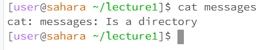

# JC's Lab Report 1

## "cd" command
* cd with no arguments 
    -
    -
    -
* cd with directory as argument 
    -
    -
    -
* cd with file as argument 
    -
    -
    -
## "ls" command
* ls with no arguments 
    -
    -
    -
* ls with directory as argument 
    -
    -
    -
* ls with file as argument 
    -
    -
    -

## "cat" command
* cat with no arguments 
    -
    -
    -
* cat with directory as argument 
    -
    -
    -
* cat with file as argument 
    -
    -
    -
