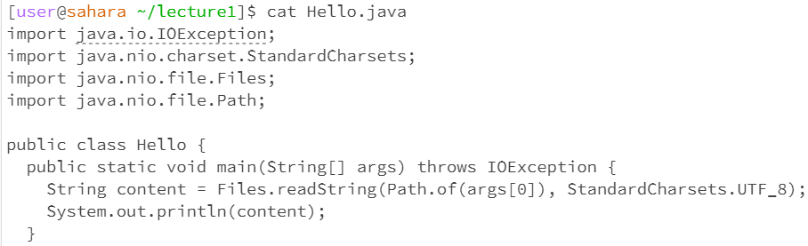

<body style="background-color:goldenrod;">
# JC's Lab Report 1

## "cd" command
* cd with no arguments
* 
    - working directory: ```/home```
    - since there was no argument, the working directory wasn't changed.
    - it could be considered an error because the intent behind the command is to change directories. With a null input, it has nothing to act on. So, even though there is no error message, I'd still say that it was.
* cd with directory as argument
* 
    - working directory: ```/home/lecture1```
    - provided with a directory as input, the working directory was succesfully changed.
    - no error.
* cd with file as argument
* 
    - working directory: ```/home/lecture1```
    - since a file is not a directory, the terminal returned an error message stating so, and no changes were made to the working directory.
    - error, due to incorrect input type.
      
## "ls" command
* ls with no arguments
* 
    - working directory: ```/home```
    - it listed the only folder in the home directory.
    - no error.
* ls with directory as argument
* 
    - working directory: ```/home```
    - it listed every file and folder in the provided directory
    - no error.
* ls with file as argument
* 
    - working directory: ```/home```
    - it listed the filepath that was provided as an argument.
    - error, due to improper input, only the given file was listed, instead of every file or folder in a directory.

## "cat" command
* cat with no arguments
* 
    - working directory: ```/home```
    - since there was no input, nothing was printed.
    - error, because it's supposed to print the contents of something, yet nothing was provided to read the contents of.
* cat with directory as argument
* 
    - working directory: ```/home/lecture1```
    - it returned an error message due to invalid input.
    - error, because it is designed to read contents of files, not directories.
* cat with file as argument
* 
    - working directory: ```/home/lecture1```
    - it printed the contents of the file correctly.
    - no error.
</body>
